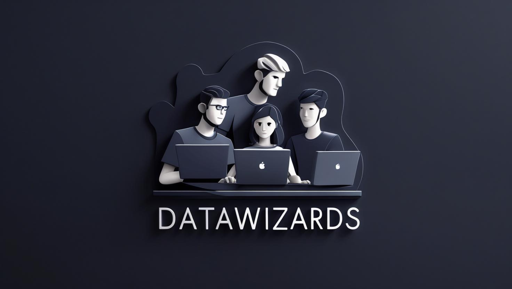

# redBus Demand Forecasting - Redbus Data Decode Hackathon 2025

<div align="center">
  <table>
    <tr>
      <td align="center">
        
        <br/>
        <strong>Redbus Data Decode Hackathon 2025</strong>
      </td>
      <td align="center">
        
        <br/>
        <strong>Bada Data Wizards</strong>
      </td>
    </tr>
  </table>
</div>

Welcome to our official project repository for the **Redbus Data Decode Hackathon 2025**, where we, the **Bada Data Wizards**, aim to solve a real-world demand forecasting challenge using big data and machine learning.

---

## Objective

The goal of this project is to **predict bus seat demand** at a **route level**, **15 days before the actual journey date**. Using historical transactions, search data, and booking patterns, we aim to build a robust demand forecasting pipeline that can aid redBus in:

- Optimizing dynamic pricing
- Enhancing operational planning
- Improving customer experience through demand prediction

---

## Project Structure

```
redbus-demand-forecast/
├── assets/                 # Images and media files
│   ├── hackathon-banner.png
│   └── team-avatar.jpg
├── data/                    # Raw datasets (ignored in Git)
├── notebooks/              # Jupyter notebooks for EDA and prototyping
├── src/                    # Source code (modular pipeline)
│   ├── data_prep.py
│   ├── feature_eng.py
│   ├── model_train.py
│   ├── predict.py
├── models/                 # Saved models
├── submissions/            # Prediction files for submission
├── requirements.txt        # Python dependencies
├── .gitignore             # Git ignore rules
├── README.md              # Project documentation (this file)
```

---

## Problem Statement Summary

Forecast demand (i.e., `final_seatcount`) for each route (`srcid`, `destid`) **15 days before** the journey date (`doj`), using:

- Historical bookings
- Cumulative search volume
- Booking trends based on region and city tier

**Evaluation Metric:** RMSE (Root Mean Squared Error)  
**Programming Language:** Python only

---

## Tech Stack

- **Python 3.10+**
- **PySpark** (preferred for scalable data processing)
- **Pandas** (optional for prototyping)
- **Scikit-learn**, **XGBoost** (for modeling)
- **Matplotlib**, **Seaborn** (for EDA and visualization)
- **Jupyter Notebook** (for experimentation)

---

## Setup Instructions

1. **Clone the repository:**
   ```bash
   git clone https://github.com/your-username/redbus-demand-forecast.git
   cd redbus-demand-forecast
   ```

2. **Create and activate virtual environment:**
   ```bash
   python -m venv venv
   source venv/bin/activate  # or venv\Scripts\activate on Windows
   ```

3. **Install dependencies:**
   ```bash
   pip install -r requirements.txt
   ```

4. **Place the datasets** (train.csv, test.csv, transactions.csv, etc.) inside the `/data` folder.

5. **Start exploring using:**
   ```bash
   jupyter notebook
   ```

---

## Approach & Methodology

We combine traditional transactional forecasting with **region-aware modeling** and **tier-wise demand segmentation**. Our model captures regional seasonality, search behavior trends, and route saturation dynamics, giving redBus a multi-dimensional view of demand prediction — not just point estimates.

---

## Hackathon Information

- **Team Name:** Bada Data Wizards
- **Hackathon:** Redbus Data Decode Hackathon 2025
- **Organized By:** RedBus
- **Challenge:** Demand Forecasting 15 Days in Advance
- **Evaluation Metric:** RMSE

---

## Project Status

- [x] Project structure setup
- [x] Data downloaded and placed
- [ ] Exploratory Data Analysis (WIP)
- [ ] Feature Engineering
- [ ] Model Training
- [ ] Evaluation & Optimization
- [ ] Final Submission

---

## Team Members

<!-- Add your team members here -->
| Name | Role | Contact |
|------|------|---------|
| Anirudh Handa | Big Data & Model Architect | [GitHub/LinkedIn] |
| [Team Member 2] | [Role] | [Contact] |
| [Team Member 3] | [Role] | [Contact] |
| [Team Member 4] | [Role] | [Contact] |

---

## Contribution Guidelines

- Create a new branch for each feature/module
- Use clear and descriptive commit messages
- Keep notebooks clean and export logic to `src/` once finalized
- Document all functions and classes
- Follow PEP 8 style guidelines

---

## License & Disclaimer

This repository is strictly for **educational and hackathon purposes only**.  
All data used belongs to **RedBus** and the respective hackathon organizers.

---

**Team:** Bada Data Wizards  
**Last Updated:** [Current Date]